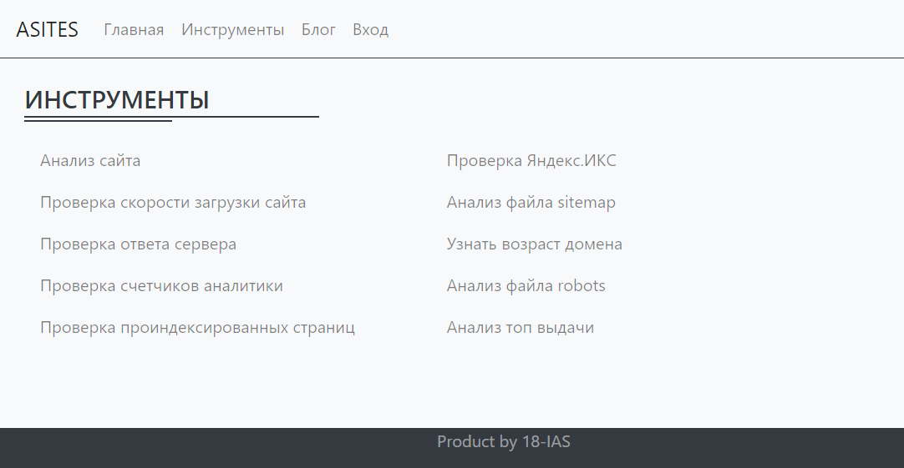

# Asites - site analysis

Asites - web-service for site analysis. The application implements 2 types of analysis: general site analysis and analysis of individual indicators. The application has an admin panel that displays analysis statistics.

The application architecture is based on the MVC pattern.
- Frontend: bootstrap + JS.
- Backend: php.

### The general analysis:
1. Checking the site quality index according to Yandex services.
2. Checking the analytics counters.
3. Checking for file availability robots.txt .
4. Checking for the sitemap file.
5. Html loading speed.
6. The size of the html page.
7. Analysis of the main page tags.
8. Analysis of the download speed through the PageSpeed Insights service.
9. The age of the site.
### The following functionality is available in the toolbar:
1. Analysis of the sitemap file.
2. File analysis robots.txt .
3. Checking the server response.
4. Checking the site loading speed.
5. Checking the site quality index according to Yandex services.
6. Checking analytics counters.
7. The age of the site domain.
8. Analysis of the top search engine output.
9. Checking indexed pages.

## How to use
Copy project files to web server with PHP 7+, PDO and CURL extensions.
